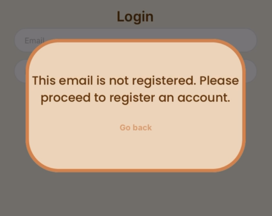

**NUSWhere?**

National University of Singapore

CP2106

**Joey Lee Leyi**

**Lim Jun Xian**

Proposed Level of Achievement: Apollo

Year: 2023

Content

[TOC]

##

## Getting Started

Test out NUSWhere pre-build from the following link:

[https://expo.dev/@iosusers/NUSWhere?serviceType=classic&distribution=expo-go](https://expo.dev/@iosusers/NUSWhere?serviceType=classic&distribution=expo-go)

Please head to App store or Play store to have Expo go installed and scan the QR code reflected in the above link. \
 \
_Note: For iOS users only \
Please proceed to create an expo account. Send your email account used for expo to Jun Xian @jx0601 (Telegram) or Joey @applepiofmyeye (Telegram). We will be sending an invitation request to your email. Please proceed to check your inbox or spam for the invitation email and accept the invitation. Afterwhich, you can proceed to scan the QR code in the above link._

You may choose to use this testing account to run our application.

Email: test@gmail.com

Password: 12345678

Otherwise, you may proceed to register a new account and test our application. Feel free to contact _Jun Xian @jx0601 (Telegram) or Joey @applepiofmyeye (Telegram)_ if you face any issues with our application. \

##

## Project Overview

### Motivation

As freshmen at NUS, we have encountered difficulties in navigating the vast university campus. Despite using popular map applications (apps) like Google Maps, we have found that they lack comprehensive navigation information for different venues within NUS. Additionally, we often find ourselves forgetting how to get to our venues for class at the beginning of the semester. We have also noticed that there are often many visitors visiting NUS. According to NUSNews, for NUS Open House 2023 alone, "[s]ome 7.71 million visitors attended the physical and online showcase which involved 3,071 faculty and staff, students and alumni".[^1] In our own experience, we recall visitors approaching us for directions but we are often unsure of the venue location ourselves.

Another factor to consider is Singapore's warm and humid weather, where periods of rain are irregular and we observe that we do not have the habit of bringing an umbrella along. Unfortunately, it is a common experience of having to wait for the rain to stop before we can walk across the street to reach another building as we are unsure how each building in NUS is connected.

Therefore, we thought to ourselves, why isn’t there a NUS navigation app that specifically helps out visitors and students like ourselves to commute around places in NUS with ease?

### Aim

We aim to develop a navigation mobile application so that information on travelling around the NUS campus is easily accessible and anyone can travel around the NUS campus with ease.

### User Stories

- As an exchange student / NUS student / visitor who is unfamiliar with the NUS campus, I want to be able to **find routes to venues easily and quickly**.
- As an exchange student / NUS student / visitor commuting around NUS campus, I want to find the **nearest bus stop at my current location** for transportation.
- As a student with lessons at the same venue regularly, I would like to** save certain routes** for easy access in the future instead of repeatedly searching for directions.
- When it rains, as someone who may have forgotten my umbrella, I would like to find **sheltered walkways around campus** to avoid being caught in heavy rain.

## Features

_Legend_

**_For Future Development_** tags indicate that these are features which can be worked on beyond the Orbital project to enhance the overall project.

### User Authentication

Upon opening our app, users will be directed to the Login Screen to enter their registered email and password. We utilised firebase authentication to identify users of our application.

If they are not registered with us, they will be prompted to register an account with us, as shown in the figure below.




Image (left): Login Screen where users will login or choose to register (button at the bottom)

Image (right): Error message shown when users enter an email which is not registered with NUSWhere

Upon successful login, users will be directed to their profile page. We have utilised ‘pullstate’ to help manage the state of our application, whether they can proceed to utilise the features of our application or remain logged out. We store 3 properties:

1. ‘initialised’ property that helps manage the authentication flow and ensures that navigation-related logic only takes place after the authentication state has been properly initialised.
2. ‘isLoggedIn’ property to check if a user has logged into their account.
3. ‘user’ property that keeps track of the current user using the application.

The Register Screen, as shown below, is where users will register their display name, email and password with us. The input username is stored under their respective profiles in firebase.


Image: Register Screen

Our Login and Register Screens also provide password-hiding, which refers to the (••••••) when users enter their password into the “Password” input box.

**_For Future Development:_**

In order to speed up the on-boarding process for our users, we could add other user authentication methods: via Google or Apple.

In addition, we could consider an implementation such that when users did not log out from our application, relaunching our application will not prompt them to login again.

Furthermore, users may have forgotten their password when trying to log in. After many unsuccessful attempts of logging in, their accounts will be locked by firebase and no longer accessible. The only alternative for them is to register another account in order to use our application again, bringing much inconvenience. Creating a page for users to reset their password will be beneficial as a further development of our application.

####

#### Error handling for Login/Register Screens

In anticipation of incorrect user input, we have put in place error messages in our Login and Register Screen. These would include:

- Incorrect email format [Both Login and Register]
- Incorrect password [Login]
- Email not registered [Login]
- Password and re-enter password mismatch [Register]
- Password requirements not met [Register]

The error would appear below the input boxes in red, to draw users’ attention while not being too jarring. The figure below shows an example of such an error message.


Image: an error message appearing when user tries to input “kloehjshsd” as email.

###

### Map Directions

Our map directions feature is broken up into two main components: Autocomplete NUS Venues, Routing with Navigation. This feature is considered one of the many complex features in our application. More details about the rendering of a map in our application can be found under the Map Page section in Complex Issues.

To begin with, in order to search for map directions to a venue, users will key into the search bar

1. Their current location
2. The venue they would like to go to.

#### Autocomplete NUS Venues

When users enter the prefix of a location into the map page, a dropdown menu will appear which will list the venues matching the prefix entered by users. The image below illustrates this feature.


Image: Autocomplete dropdown menu feature

The list of venues and buildings are being read from a JSON file in the app codebase. We merge these files into an array, storing the names of the buildings or venues in the data. Upon typing input in the search bar, the data is then filtered out and rendered as a list; either nothing appears if the search bar is empty or a menu, which lists NUS location names or "No such venue" if the search bar has some text. Users will have to press an item in the list. Correspondingly, the ‘origin’ or ‘destination’ variable in our code will be set as the coordinates associated with that name to perform route searching as explained under Routes and Navigation.

**_For Future Development:_**

We acknowledge a common problem that surfaced among family members, peers, or friends from NUS who have tried our application; the menu containing the list of suggested venues is unscrollable. However, due to time constraints, we are unable to rectify this issue by Milestone 3 and decided to improve this problematic user interaction beyond the Orbital project.

Another limitation is the restriction that users have to select one of the options provided in the suggested list in order for our application to register the location and thereafter, query for routes, unlike Google Maps. We hope to enhance the search feature to be like Google Maps, which is complicated and we decided to do it beyond the Orbital project.

Furthermore, there are currently some venues that are absent in our JSON files, e.g. COM3 related venues. To ensure the completeness of NUS location data, it requires a lot of time and effort to collect and record the data which we couldn’t afford to do before Milestone 3.

#### Routing and Navigation – Routes Screen

Upon clicking the menu items, markers will then indicate the user’s current location and the selected destination venue. The button “Routes” will then appear at the bottom of the screen, taking users to the Routes Screen.


Image: Indicators on map and route button appear on screen

This was implemented using the MapView class of the ‘react-native-maps’ API, which provides the interactive map that is rendered as the background of this page.

Once the two marker locations have been set, on pressing the routes button, a polyline will be drawn from the origin to the destination using the ‘react-native-maps-directions’ API.

Upon pressing the ‘Routes’ button after keying in current location and destination, the map page displays multiple routes, which users can click into for more information:

1. Walking route (outdoor)
2. Sheltered walking route
3. NUS bus routes (**_Current: _**not able to calculate bus routes together with walking)


    Image: A sample screen showing the multiple route options offered to users.

At this juncture, there is a “Back” button available. This is a backward navigation feature, which reloads the map page to its initial state so that users can search for another direction.

Upon clicking one of the three different routes as shown in the image above, they will be brought to the route page that displays direction instructions to users. For more information on how these directions are generated, in particular, the sheltered route and bus route, please refer to the Algorithms section of this README. A sample of how the route page will look is shown below.

All three routes will present the directions of each step to be taken from one venue to another (direction steps). However, some routes will provide additional information.

1. The sheltered route will have an additional component -- the photos of walkways between buildings will be displayed to users.
2. The bus route indicates the bus numbers that users have to take to commute between 2 bus stops.

_The different instructions, indicated by the circle logo on the left are called “directionSteps” in the Google Map API, and we will be referring to them as direction steps in this README._


Image (left): A sample screen showing each direction step that should be taken (The Deck to COM1-0209 by Outdoor route)

Image (right): A sample screen showing each direction step that should be taken (COM 2 to i3-0344 by Bus route)

The page also includes an “Add to Favourites” button which allows users to save this route for future use if the route is not already added. Otherwise, a “Remove from Favourites button” will be shown which allows users to delete the saved route from their profile page. The features and implementation for this favourite feature will be further elaborated under the Favourite Routes section of this README.

**_For Future Development:_**

As we reference our current implementation against the robust, well known Google Maps, we hope that in the future, we are able to develop additional filters that can allow users to select other modes of transport: cycling routes, or by driving, like Google Maps.

In addition, we are aiming to enhance our navigation system to provide better support for combining outdoor, sheltered, and bus directions for seamless navigation. This will improve user experience if our application enables users to seamlessly transition between walking and taking the bus during their journey.

For better user experience, we want to incorporate a user location feature such that the application immediately registers users current location and they need not figure out where exactly they are in NUS and type the location name inside the search bar, which they may not be fully aware of.

Furthermore, we noticed that our application does not automatically zoom the map into the user's current location once it is rendered by our application. In addition, upon searching for routes, even though there is a polyline drawn between the origin and destination, this visual display is not in focus automatically like Google Maps. We aim to work towards improving the map functionality liken to Google Maps in the future.

The duration provided for sheltered and bus routes are currently hardcoded values which is not an ideal estimation of how long users need to travel there. It will be good if we are able to obtain insights of how Google Maps renders duration time of their suggested routes to users.

####

#### Alerts when using Map Directions

There are three particular alert messages that users may encounter when using our Map Directions feature.

Firstly, if they were to enter the exact same locations in their start and destination search bars, an alert message would pop up as shown below.

####


#### Image: Alert shown to users when origin and destination are the same

Another alert message that users may face is when the venues they keyed in happen to be in the same building. Our application will not redirect users to the list of directions page. The alert message is as shown below.


Image: Alert message when venues are in the same building.

The last alert message shows users that we are unable to provide any routes to users as with our current implementation, there are no suggested routes to users by that mode of transport. A sample of the alert message is as shown below when users selected the bus route option.


Image: Alert message that informs users that our application is unable to provide directions for that mode of transportation.

#### Sheltered Walkways

Our sheltered walkways feature, which is one of our major motivations for our application, complements the route feature, which is our application’s unique selling point. It is similar to indoor navigation but not in real time.

In the sheltered route page, users will be provided visual guides -- static pictures of sheltered walkways between two buildings. The visual guides are static images and they will be displayed in between building names in the routes page as shown below. The sheltered linkway between NUS buildings is not necessarily a single path. Hence, we provided each direction step a carousel of pictures, which users can swipe to view the complete sheltered linkway between NUS buildings.


Image: Sheltered route page from AS6-0208 to COM1-0212 with visual guides.

(Photo credits: Joey)

The images that are present for display for the sheltered route amounts to almost 150 pictures of walkways between buildings, which are subsequently stored in Firebase Storage. We categorised our image files under respective folders, with each folder’s name being a particular NUS building. These folders (sub folders) are collated and grouped under one folder, with this folder name being the name of the NUS building that is connected to the other buildings as stated in the sub folder. An illustration of the file organisation is as shown in the image below.


Image: A sample of how images are stored between AS7 and other buildings

For example, to retrieve the images between AS3 and AS4 if it is in the direction step of the sheltered route, our application queries for all the images in /AS3/AS4, with reference to the above image. Each image from Firebase Firestore has a download URL which is retrieved then rendered as the source of an ‘Image’ component.

As our database of images isn’t complete, our sheltered route will not be able to fully display all possible images between two NUS buildings and thus, the sheltered route page will render “No image available”.

After querying the images from Firebase Storage, the images are rendered into a FlatList asynchronously after the runtime of the sheltered routes page component.

For better user interface, our application provides information on the number of images that are successfully acquired/available from our Firebase Storage. The FlatList of images is paginated as illustrated in the image above (the dots below the images rendered). It makes use of tracking the visible items on the screen -- a feature supported by React Native, to check when the image has been swiped to the next page. Upon swiping, it increments or decrements the dots at the bottom of the page and renders them based on the index of the page.

Rendering this sheltered routes page is yet another complex feature of our application. We will be explaining its complexity under Images Rendering for Sheltered Walkways in Complex Issues.

**_For Future Development:_**

We realised that images displayed may not be sufficient to help visitors locate where the sheltered walkway is. We are considering including the level of each linkway to be provided for users to ease their navigation in NUS.

Furthermore, considering the large amount of data and time needed to travel around NUS to collate all possible sheltered walkways in NUS, it is impossible for us to gather all the possible data in the short span of Orbital. Furthermore, as users of our application will often travel in NUS, it would be wise to consider opening contributions from our users themselves; sending a report / feedback to our database on relevant updated data (e.g. if there is construction and the sheltered walkway is not accessible) or images of sheltered walkways that are currently unavailable in our application. This could be done through a small “Report” feature such as what Google Maps does to refine its database to provide accurate data.

###

### Nearest Bus Stops

Moving on, our nearest bus stop feature allows users to observe the nearest bus stops at their current location as listed in this page. We acknowledged the existence of the NUSNext-Bus application which serves this purpose but the motivation of implementing this feature is to provide ease to users; they do not require to toggle between different applications to acquire the relevant bus stop information such as real bus timings and bus routes of each buses at the bus stop.

We have tried our best to obtain data of real-time NUS bus arrival timings but unfortunately, there is no such available public API for our application to use. Hence, we have decided to implement the feature without any real-time bus arrival timings. \

As shown in the image below, this is how our nearest bus stop feature looks like.


\

Image (Right): Upon clicking “Oei Tiong Ham Building”, users will be shown the list of buses that are arriving and the timing it would take. \
Image (Left): Upon clicking “Oei Tiong Ham” again, the information under “Kent Ridge MRT” is hidden.

The bus stops data are acquired from our internal codebase JSON file. For first time users of our application, they will be prompted to allow our application to have access to their current location. We made use of the ‘Location’ API by Expo for this function.Upon allowing access to the location, our application tries to pick up the user's location. Subsequently, our application will order the proximity of the bus stops in the bus stops data and render it on the page, with the first bus stop displayed being the nearest to the user. This was achieved through the ‘geolib’ library; we compared the coordinate of each bus stop against the user’s current location and ordered the bus stop data according to proximity.

Users can click any of the items in the list. If they click it the first time, the users will be shown the buses that are arriving at that stop, as shown on the right image above. Clicking the bus stop again hides the relevant bus stop information, as shown on the left image above.

In the case where users have changed their location but our application does not register the change, they can click on the ‘Refresh’ button at the bottom of the screen for our application to obtain the user’s current location and reorder the bus stop data displayed in the nearest bus stop page.

**_For Future Development:_**

We understand the limitations of this feature — the absence of real-time NUS bus arrival timings, which we foresee that we may not be able to solve in the future unless we are able to successfully collaborate with the developers of the NUSNext-Bus application in order to make this feature more robust.

#### Error handling for Nearest Bus Stops

As users will be prompted to grant permission for our application to access their location, users may not allow it. Thus, we will alert users as shown below.


Image: Alert message shown to users if they deny access of location

Another error that users may encounter is that our application is taking too long to register the user's current location after the user has granted permission. An alert message, illustrated by the image below, will be shown to users.


Image: Alert message to users when our application fails to register their current location

### Favourite Routes

Lastly, our Favourite Routes feature allows users to save a route direction that is obtained from the routes page. The list of saved routes will appear under the user’s profile page as shown in the image below. The saved name of the route has two components:

1. Origin and Destination of route
2. Mode of transportation


Image: Routes in the Favourite Routes section with different modes of transport

Upon clicking one of the three different routes as previously illustrated under Routing and Navigation, users are redirected to the routes page. Inside, there is a “Add to Favourites” button at the bottom of every route page. Pressing the button will save this route under the user’s profile. We utilised the Firebase Firestore system, storing the favourite routes of users under the favouriteRoutes collection, with each document unique to users of our application (based on user’s uid). We saved the parameters that are required to render the same route page, in particular:

1. Origin (String, name of start point)
2. Destination (String, name of end point)
3. Directions (String, direction step concatenated together, separated by “/” )
4. Duration (String, estimated duration of travel)
5. Mode (String, method of transportation)
6. Route (String, for Bus routes which keep track of the buses to take, otherwise null)

An illustration of how our favourites collection looks is shown in the image below.


Image: Firebase Firestore favoriteRoutes collection, showing a particular user document.

This method of organising our Firebase Firestore allowed efficient query of user’s favourite routes and thus, favourite routes list under each user’s profile page is rendered efficiently and accurately.

Users can then head to the profile page to check on the saved route. In the event if the saved route is not reflected, users can swipe down to refresh the page. By then, the saved route will be successfully reflected in the profile page.

Upon clicking one of the saved routes under the profile page, users will be redirected to the routes page, as shown in the image below. As the route is already saved, the button below shows “Remove from Favourites”, which gives users the option to delete this route from their favourite routes list.


Image: Routes page that allows users to remove this route from their favourite routes list.

The change in display of the button from the initial “Add to favourites” to “Remove from Favourites in routes page is due to querying our Firebase Firestore. In the routes page component in our codebase, it queries first whether this route has or has not been stored in the user’s account. If it has been saved, the button will render as “Remove from Favourites” and if it has not been saved, “Add to Favourites”, with each button serving its intended purpose as previously illustrated.

**_For Future Development:_**

Users are likely to forget their intention of saving the route if they were to use our application again. We opt to develop a feature such that users can set a name for their saved route for easy future reference.

## Complex Features

### Algorithm

#### Shortest Path Algorithm

As we would need to combine both the NUS internal shuttle bus routes as well as walking navigation, we cannot rely solely on the Routes API as Google does not have information on the NUS buses, as well as linkways between different buildings. As such, we have designed an algorithm that would calculate the best bus route to take from one bus stop to another, as well as routing of how to go from one building to another through connecting walkways.

##### BFS algorithm with NUS Internal Shuttle Bus Services (NUS ISB)

For searching the best bus route, we have opted our algorithm to output the least number of bus stops that users have to take from their starting location to destination.

We gathered the relevant bus stop data and stored it in a JSON file which we will be utilising in our algorithm. The JSON file is an array of Objects with the following properties:

1.  name: String
2.  location: Number[ ]
3.  code: String
4.  routes: String[ ]
5.  neighbors: Object {

    A1: String

        A2: String


        D1: String


        D2: String


        BTC: String


        K: String

    E: String

    }

    Note: The string value for each key under the neighbors property will be the name of the next possible bus stop to go to from the current bus stop.

An example would be:

```
    {
          "name": "Information Technology",
          "location": [
            1.297209289330673,
            103.77268731594086
          ],
          "code": "COMCEN",
          "routes": [
            "A2",
            "E",
            "D1"
          ],
          "neighbors":{
            "A2": "Opp YIH",
            "E": "Opp YIH",
            "D1": "Opp YIH"
          }
    },
```

To illustrate the interpretation of ‘neighbors’ property using the above example, it states that the Information Technology bus stop goes to Opp YIH bus stop via A2, E, or D1.

We have input our implementation of our algorithm as shown in the image below, with comments to illustrate the logic of our algorithm.

```
// Find shortest bus route
function findBestBusRoute(start, destination) {
  const queue = []; // Stores bus stops to visit.
  const visited = new Set(); // Stores bus stops already visited.
  const parent = {}; // Stores bus stop that is previously visited before visiting the current bus stop.
  const parentRoute = {}; // Stores relevant bus stop information of the parent.

  if (start === destination) {
    return null;
  }

  // Variables to check if start and destination provided is a venue/building name.
  let startBusStop = null;
  let startIsBusStop = true;
  let endBusStop = null;
  let endIsBusStop = true;

  for (const key of Object.keys(buildingsJson)) {
    if (buildingsJson[key].name === start) {
      startBusStop = buildingsJson[key].busStop;
      startIsBusStop = false;
      break;
    }
  }

  for (const key of Object.keys(buildingsJson)) {
    if (buildingsJson[key].name === destination) {
      endBusStop = buildingsJson[key].busStop;
      endIsBusStop = false;
      break;
    }
  }

  for (const key of Object.keys(venuesJson)) {
    if (key === start) {
      startBusStop = venuesJson[key].busStop;
      startIsBusStop = false;
      break;
    }
  }

  for (const key of Object.keys(venuesJson)) {
    if (key === destination) {
      endBusStop = venuesJson[key].busStop;
      endIsBusStop = false;
      break;
    }
  }

  if (startBusStop == endBusStop) {
    return null;
  }

  queue.push(startBusStop);
  visited.add(startBusStop);


  // BFS algorithm
  while (queue.length > 0) {
    const currentNode = queue.shift();

    if (startIsBusStop && endIsBusStop) {
      if (currentNode === destination) {
        return constructRoute(parent, parentRoute, start, destination, destination);
      }
    } else if (startIsBusStop && !endIsBusStop) {
      if (currentNode === endBusStop) {
        return constructRoute(parent, parentRoute, start, endBusStop, destination);
      }
    } else if (!startIsBusStop && !endIsBusStop) {
      if (currentNode === endBusStop) {
        return constructRoute(parent, parentRoute, startBusStop, endBusStop, destination);
      }
    }

    const currentNeighbors = neighborBusSet[currentNode];

    for (const n of currentNeighbors) {
      if (!visited.has(n)) {
        queue.push(n);
        visited.add(n);
        parent[n] = currentNode;
        parentRoute[currentNode] = routesBusSet[currentNode];
      }
    }
  }
  // No valid route found
  return null;
}

function constructRoute(parent, parentRoute, startBusStop, endBusStop, destination) {
  const route = [];

  let current = endBusStop;

  // Retracing bus route
  while (current !== startBusStop) {
    route.unshift(current);
    current = parent[current];
  }

  route.unshift(startBusStop);

  const newRoute = []; // What will be displayed in the routes page, elements are direction step.
  const busRoutes = []; // Stores the buses to take from one stop to another.
  const buses = []; // Store all buses that users may need to take.
  for (let i = 0; i < route.length - 1; i++) {
    const from = route[i];
    const to = route[i + 1];
    console.log(i + ' ' + from);
    console.log(i + ' ' + to);
    newRoute[i + 1] = route[i + 1] + ". To reach, take bus:" + parentRoute[from][to].map(x => " " + x);
    busRoutes.push(parentRoute[from][to]);
  }
  newRoute[0] = "Walk to Bus Stop: " + route[0];
  newRoute.push("Walk to " + destination);

  function inArray(element, array) {
    let bool = false;
    for (let i = 0; i < array.length; i++) {
      if (array[i] === element) {
        bool = true;
      }
    }
    return bool;
  }

  for (let i = 0; i < busRoutes.length; i++) {
    const curr = busRoutes[i];
    for (let j = 0; j < curr.length; j++) {
      if (!inArray(curr[j], buses)) {
        buses.push(curr[j]);
      }
    }
  }

  return {
    route: newRoute,
    busRoutes: buses,
  };
}
```

Image: Code of our algorithm for bus routes, with comments illustrating how our algorithm works

**_For Future Development:_**

We acknowledge that our algorithm is lacking in a few ways:

1. Implementation considers multiple transfer of buses which users may not like as it deems as troublesome.
2. Recommended bus routes may lead to users travelling a loop (e.g. Users may be asked to take a bus to its terminal and take the same bus again.) This observed behaviour is because we failed to consider that some bus stops are opposite of one another and can be reached by walking distance. Our ‘neighbors’ property in the JSON file considers purely the mode of transportation to the other bus stop by another bus.

We wish to improve the accuracy of our bus routes algorithm by tackling the above mentioned limitations, allowing us to provide more precise and reliable directions for bus travel. These enhancements are definitely feasible but due to time constraints, they have been on hold and will be worked on beyond Milestone 3.

##### BFS algorithm for Sheltered route

The code structure of the algorithm is very similar to the previously mentioned algorithm. For this algorithm, we had to gather data of NUS buildings and store them in a JSON file. The JSON file is an array of Objects with the following properties:

1. name: String
2. neighbours: String[ ], elements are names of other NUS buildings which connects to this building
3. location: Number[ ]
4. busStop: String, this property is used for the previous algorithm

An example of an object in the JSON file would be:

"COM1": {

    "name": "COM1",

    "neighbours": ["COM2", "COM3", "AS6"],

    "location": {

            "x": 1.2948903220382768,

            "y": 103.77378095810657

}

**_For Future Development:_**

In general, we feel that our algorithms could be improved further to include the following considerations:

- Loading from Firebase, which would improve scalability and support more efficient updates.
- Combining this algorithm together with NUS ISB algorithm (We realised that most buses are connected to a sheltered building.)

### Map page

The map page consisted of a few complex components and combining them into the page to render smoothly also posed as a fun challenge. The Autocomplete component, while taken from an online source, had to be understood and modified to suit our needs.

This meant that the Autocomplete components had to also set the marker locations on the map page upon pressing.

At the top of the page, we can see the two text boxes which are rendered by the Autocomplete component.

Upon selecting from the dropdown box, the names of “COM1-0212” and “BIZ2-0301” are looked up in our dataset, and the locations are returned. This will then callback the functions ‘setOrigin’ and ‘setDestination’, which set the markers of the map view as the coordinates provided.

In this image, the values have already been selected.

After both markers have been selected, the “Routes” button will be rendered visible.

Clicking this button will set the ‘showRoute’ variable to ‘true’, and draw a PolyLine in the page. The Polyline is drawn using the react-native-map-directions API.

As such, the data of the coordinates of each item should be able to be linked to the button, such that on pressing, the coordinates would be sent back to the MapView component and a marker will be placed in the correct position. This was done through key-value pairs for efficient accessing of the values of the coordinates of each venue.

### Image Rendering for Sheltered Walkways

The rendering of walkways between two different buildings posed a big challenge.

Prior to the implementation of this feature, the photos rendered in the app were all locally stored within the codebase as png files. As the photos taken were in HEIC format (iOS), the files were significantly larger, and uploading all the photos to the codebase was inefficient. It was time consuming and not scalable in the long run.

To solve the issue, images are stored in Firebase Storage instead. However, another issue arose due to the large amount of data is the sorting of these data. Thus, we need to structure and design the organisation of data in our Firebase Storage as often, our application only queries for some images in this large database. Hence, designing the structure of storing data needs careful consideration and we ultimately decided to organise the files in an ‘adjacency list’-like structure as previously mentioned under the Sheltered Routes feature.

The rendering of the image along with animated dots below the pictures were also rather complex. As mentioned in the Sheltered Walkways section of the features, the pictures were rendered as a FlatList and paginated. The dots are a separate component from the FlatList component. Thus, to incorporate the two separate features requires careful reading of documentation and implementation. Our code utilises the onViewableItemsChanged prop to check if the image is swiped, before changing the index of the paginated dots, based on the index of the viewable image (tagged as the id of the FlatList item).

### Routing

For the navigation between the pages of our app, we are making use of Expo Router Stack Navigator and React Navigation Bottom Navigation. Our application makes use of the Expo Router for navigation purposes for its simple file path-based routing. It wraps the React Navigation library but because Expo library is relatively new, it was difficult to find examples and tutorials with for example saving the href of a page. Using both the react-bottom-navigator and expo-router libraries were difficult due to the limited documentation and not many examples on code which merged the two.

## Known Issues (Problems Encountered)

### Map Direction

Developing our app's navigation feature for NUS posed several challenges. The Google Maps API lacks critical data on NUS internal shuttle services and bus stops. To address this, we had to create our own algorithm and organise NUS bus stop data for efficient querying, as mentioned above. Navigating between locations within the campus proved complex due to multiple bus options and potential transfers. Integrating an interactive map with React Navigation Map and Google Maps API also required careful implementation.

There are also many limitations that we have raised under the Map Directions feature which has yet to be solved as stated due to time constraints.

### Image Rendering

As mentioned above in the Complex Feature section, the rendering of images for the sheltered walkways in our app did pose some issues.

There are certain limitations to the current implementation, which is the ordering of the images. Due to the asynchronous nature of how the images are loaded, they are not necessarily loaded in the correct order. This could be rectified by id-ing the images then querying for each id. However, we have not uploaded all 150 images onto Firebase Firestore at time of writing and hence have left that out as an update for future development.

### Testing

We planned to conduct our automated unit test using Jest. However, we encountered error messages “ReferenceError: self is not defined”, prompting that it appears under node_modules/@firebase and “Couldn’t find a navigation object. Is your object in a navigation container?”, highlighting the code of const router = useRouter() in the component we are testing. We have personally tried to troubleshoot ourselves by uninstalling Jest and reinstalling it. We conduct a thorough check on the dependencies and various configurations that are suggested based on the Expo webpage for unit testing. However, to no avail, the error continues to persist. We have seeked our advisor for help to enlighten us on where the error lies. Our advisor tried to help us by tweaking certain parts of our code but the error continuously persists. We continuously checked the sources on the internet for guidance. The issue is resolved by installing the jest-environment-jsdom package and commenting out the lines that attempt to redefine the performance and windows property under node_modules/react-native/jest/setup.js. This is a temporary quick fix as such changes made is not a good practice as our dependencies of our application may update these changes we made.

## Software Engineering Practices

### Version Control

We have made use of Github for version control, where we made use of **branching** to work on different parts of the app separately. The image below shows the branches used: ‘main’, ‘master’ and ‘test-branch-1’. These branches are used to ensure that we will not be editing on the main branch. Once we have finalised edits on the master and test-branch-1, we will open a new pull request and merge with the main branch.

When adding a large new feature, such as our Mappage, we have also created new branches to work on a specific feature, before merging the branch to the main branch. More information on our branches and pull requests are in the next section.


Image: the branches used for our project.

###

### Github Branching and Pull Requests

In the case of our map page and navigation, we added new branches in order to not edit directly on the development branch. Once a feature is properly implemented, we will then push to the component branch and merge with the development branch. We will also link component-based branches to any issues that were opened as “todo”. This will be elaborated further in the “Github Issues” section below.


###

### GitHub Issues

We have made use of Github Issues for task tracking, where a “todo” label is tagged on issues which are for tracking tasks to be done, and when they are done, the issue is closed.

The priority label indicates the urgency of completing the task. “documentation” and “enhancement” tags are also used to differentiate between documentation tasks and implementation tasks


### Program Flow


### Database Structure Diagram


### Entity Relationship Diagram

#### Location Data


## Testing

### User Testing

We have designed a feedback form that garners feedback from users to use our almost fully functioning application. The feedback form is released to friends and peers from NUS in particular, who tried our application immediately after the successful implementation of our favourite feature. We have designed the question as follows:


Below are snapshots of the responses we gathered from our friends and peers.


\


#### Evaluation

Alongside with the Google Form, we have gathered feedback from family and friends in person to try our app.

Many of them brought up useful feedback, and while most had positive feedback, they did find some minor issues in our code. (eg. when the search bar is empty, the suggested venues are still present to users and it does not disappear upon clicking anywhere in the screen). These and other issues have been summarised in the table below. Overall, users are very impressed by our proposed ideas in our application.

<table>
  <tr>
   <td>Feature Group 
   </td>
   <td>User Story
   </td>
   <td>Efforts made
   </td>
   <td>Possible Solutions (if we are unable to rectify issue by Milestone 3)
   </td>
  </tr>
  <tr>
   <td rowspan="2" >Autocomplete
   </td>
   <td>Suggested list doesn’t work in users favour (doesn’t disappear when there is nothing in search bar)
   </td>
   <td>Noticed that the asynchronous rendering of React caused this issue. Decide not to use the state property filteredData to check if there is any filtered data. Problem rectified.
   </td>
   <td>-
   </td>
  </tr>
  <tr>
   <td>Unable to scroll through the suggested list prompted by the application
   </td>
   <td>1. Consider using FlatList (commented code in test-branch) but to no avail. <em>“VirtualizedLists should never be nested inside plain ScrollViews with the same orientation”</em>
<p>
2. Remove animated scroll view from mappage and add scrollview component in Autocomplete. Still unscrollable.
   </td>
   <td>We are still in the midst of researching what we should do to rectify the solution.
   </td>
  </tr>
  <tr>
   <td>Route Page
   </td>
   <td>Sheltered directions information is not very useful as it indicates a list of buildings.
   </td>
   <td>Added images for visual guidance. 
   </td>
   <td>-
   </td>
  </tr>
  <tr>
   <td>User Interface
   </td>
   <td>Android users facing an issue that the route list shown upon clicking the routes button is not fitted nicely on the screen.
   </td>
   <td>Change to “90%” width instead of fixed number
   </td>
   <td>-
   </td>
  </tr>
  <tr>
   <td>Register
   </td>
   <td>Users who just registered expect to be auto-logged in and not have to return back to the login page
   </td>
   <td>Decided to router.replace() to screens by setting the AuthStore of the user to be the newly registered user.
   </td>
   <td>-
   </td>
  </tr>
  <tr>
   <td>Map page
   </td>
   <td>Searched for food places in NUS 
   </td>
   <td>Add a list of food places and convenience stores in NUS into our venues JSON file.
   </td>
   <td>-
   </td>
  </tr>
  <tr>
   <td>Map page
   </td>
   <td>Upon pressing “Back” after reaching the list of 3 routes, the map markers are still present such that previously entered locations are not erased yet. Users just merely amended one of the search bars and then route button shows up
   </td>
   <td>Removed both map markers when users pressed “Back”
   </td>
   <td>-
   </td>
  </tr>
  <tr>
   <td>Favourite Routes
   </td>
   <td>User wants to remove a number of items from the favourites but faces the issue of not user-friendly buttons nested in the route page.
   </td>
   <td>-
   </td>
   <td>Add a swipe gesture to FRList where swiping would delete the item from favourites
   </td>
  </tr>
</table>

### Unit Testing

We planned to use Jest for automated unit testing as it works optimally with React

Native applications are widely-used and supported. We have done some of the below stated tests if possible, using Jest, with the test codes documented in our GitHub repository under the branch, test-branch-2.

<table>
  <tr>
   <td>Feature
   </td>
   <td>Test Details
   </td>
   <td>Test Status
   </td>
  </tr>
  <tr>
   <td rowspan="3" >Login 
<p>
<em>(Register)</em>
   </td>
   <td>Email and Password <em>(and username and re-enter password)</em> fields are present, login <em>(register)</em> button and NUSWhere logo is present.
   </td>
   <td>Pass
   </td>
  </tr>
  <tr>
   <td>Leaving email and/or password fields blank and pressing login <em>(register) </em>reveals an error message that states “Email is required field” and/or “Password is required field.<em> (Leaving username and/or re-enter password blank renders similar error messages)</em>
   </td>
   <td>Pass
   </td>
  </tr>
  <tr>
   <td>Email and Password fields can receive inputs <em>(Username and re-enter password too)</em>
   </td>
   <td>Pass
   </td>
  </tr>
  <tr>
   <td rowspan="2" >Login/Register
   </td>
   <td>Typo in email, e.g. “<a href="mailto:jx@gmail..com">jx@gmail..com</a>” renders an error “Incorrect email format”
   </td>
   <td>Pass
   </td>
  </tr>
  <tr>
   <td>Password field text is not visible to the user (represented by black dots)
   </td>
   <td>Pass
   </td>
  </tr>
  <tr>
   <td>Register
   </td>
   <td>Password less than 8 characters renders an unsuccessful registration
   </td>
   <td>Pass
   </td>
  </tr>
  <tr>
   <td rowspan="3" >Algorithm:
<p>
findBestBusRoute
   </td>
   <td>Input current location and destination to be equal outputs null (i.e. no route)
   </td>
   <td>Pass
   </td>
  </tr>
  <tr>
   <td>Input current location and destination that requires no transfer of buses, outputs the shortest path possible with no transfers.
   </td>
   <td>Pass
   </td>
  </tr>
  <tr>
   <td>Input current location and destination that requires transfer of buses, outputs the shortest path that <em>may</em> require multiple transfers. 
   </td>
   <td>Pass
   </td>
  </tr>
  <tr>
   <td rowspan="5" >Algorithm:
<p>
findBestShelteredRoute
   </td>
   <td>Input current location and destination to be equal, outputs the building of the two locations. 
   </td>
   <td>Pass
   </td>
  </tr>
  <tr>
   <td>Input current location and destination to be in the same building, outputs the building of the two locations. 
   </td>
   <td>Pass
   </td>
  </tr>
  <tr>
   <td>Input current location and destination to be connected, outputs an array of buildings to reach to the destination, which is also the smallest possible number of buildings to walk through.
   </td>
   <td>Pass
   </td>
  </tr>
  <tr>
   <td>Input one of the locations to be an isolated building, outputs 1 (i.e., no possible sheltered walkways that connects both locations)
   </td>
   <td>Pass
   </td>
  </tr>
  <tr>
   <td>Input both locations that has sheltered walkways to other buildings but there is no sheltered route that connects the two locations, outputs 1 (i.e., no possible sheltered walkways that connects both locations) 
   </td>
   <td>Pass
   </td>
  </tr>
</table>

##


For the subsequent test cases below, we decided to do a manual testing of our system. The following table dictates our attempt in testing the user interface for the rest of the components in our application.

<table>
  <tr>
   <td>Feature
   </td>
   <td>Test Details
   </td>
   <td>Test Status
   </td>
  </tr>
  <tr>
   <td rowspan="4" >Map
   </td>
   <td>Map and 2 search bars, where one allows users to enter current location and the other their prospective destination.
   </td>
   <td>Pass
   </td>
  </tr>
  <tr>
   <td>Routes button present for users to search for directions after selecting the current location and destination. Map pointers of these two venues are present.
   </td>
   <td>Pass
   </td>
  </tr>
  <tr>
   <td>A connecting route line drawn between the two map pointers on the map.
   </td>
   <td>Pass
   </td>
  </tr>
  <tr>
   <td>3 routing options “Outdoor”, “Sheltered” and “Bus” present. Back button present for users to search for another direction.
   </td>
   <td>Pass
   </td>
  </tr>
  <tr>
   <td>Profile
   </td>
   <td>List of favourite routes displayed <em>(if present)</em> and a welcome message shown to the user logged in. Logout button present.
   </td>
   <td>Pass
   </td>
  </tr>
  <tr>
   <td>Routes Page
   </td>
   <td>Header displaying the route user has searched, the details of the directions, icon indicating the mode of transport users are opting for and a “Add to Favourites” button is present.
   </td>
   <td>Pass
   </td>
  </tr>
</table>

### Integrated Testing

We conducted integrated testing with the current progress of our application. The testing done ensures that each individual component implemented thus far works together seamlessly to achieve the desired outcomes. We focus on testing screens and features that are interdependent. Below is a table that documents our attempt of integrated testing for our current implemented features. The test cases are done sequentially.

<table>
  <tr>
   <td>Test ID
   </td>
   <td>Feature
   </td>
   <td>Testing Objective
   </td>
   <td>Steps taken
   </td>
   <td>Expected Results
   </td>
   <td>Test Status
   </td>
  </tr>
  <tr>
   <td>1
   </td>
   <td>Login
   </td>
   <td>Unable to login due to an account (i.e. email) not registered yet.
   </td>
   <td>Enter email: <a href="mailto:jxlim@gmail.com">jxlim@gmail.com</a>
<p>
Enter password:
<p>
11111111
   </td>
   <td>Error message pops up and alerts users that “This email is not registered. Please proceed to register an account.”
   </td>
   <td>Pass
   </td>
  </tr>
  <tr>
   <td>2
   </td>
   <td rowspan="2" >Register
   </td>
   <td>Successful entry
<p>
into database
<p>
with user’s email
<p>
upon signing up.
   </td>
   <td>Enter username: jx
<p>
Enter email: <a href="mailto:jxlim@gmail.com">jxlim@gmail.com</a>
<p>
Enter password:
<p>
11111111
   </td>
   <td>Firebase authentication records the new user with email <a href="mailto:jxlim@gmail.com">jxlim@gmail.com</a>. Pop up message alerts users successful registration and allows users to navigate to the login page.
   </td>
   <td>Pass
   </td>
  </tr>
  <tr>
   <td>3
   </td>
   <td>Unable to register a user if the email address is already registered. 
   </td>
   <td>Enter the same credentials as test ID 2.
   </td>
   <td>Error message pops up and alerts users that “This email is already registered. You can proceed to login or register using another account.”
   </td>
   <td>Pass
   </td>
  </tr>
  <tr>
   <td>4
   </td>
   <td rowspan="2" >Login
   </td>
   <td>Unable to login due to wrong password.
   </td>
   <td>Enter the same email as test ID 2 but password as 22222222.
   </td>
   <td>Error message pops up and alerts users that “Incorrect password entered. Please try again.”
   </td>
   <td>Pass
   </td>
  </tr>
  <tr>
   <td>5
   </td>
   <td>Successful login redirects to profile page.
   </td>
   <td>Enter the same credentials as test ID 2.
   </td>
   <td>Arrives at the profile page which displays a welcome message alongside with the username registered, i.e., “Welcome jx”
   </td>
   <td>Pass
   </td>
  </tr>
  <tr>
   <td>6
   </td>
   <td>Tab Navigator
   </td>
   <td>Able to correctly redirect to the respective screens implemented, i.e. map directions, nearest bus stops and profile.
   </td>
   <td>Press the 2 respective features at the bottom of the screen after login from test ID 5. 
   </td>
   <td>Presents the corresponding screens upon clicking each tab.
   </td>
   <td>Pass
   </td>
  </tr>
  <tr>
   <td>7
   </td>
   <td rowspan="4" >Map directions
   </td>
   <td>Users are able to see suggested NUS venues upon typing in the search bar.
   </td>
   <td>Enter “c” on the search bar.
   </td>
   <td>A list of venues that start with or contains the letter “c” appears, i.e. “COM1 02-12, COM1 02-04 etc”
   </td>
   <td>Pass
   </td>
  </tr>
  <tr>
   <td>8
   </td>
   <td>Users will not be able to see any suggestions if the venue is keyed in wrongly.
   </td>
   <td>Intended to type “com2” but accidentally typed “corm2”.
   </td>
   <td>Autosuggestion shows “No such venues.” to users.
   </td>
   <td>Pass
   </td>
  </tr>
  <tr>
   <td>9
   </td>
   <td>Users will not be able to see any suggestions if the search bar is blank.
   </td>
   <td>Firstly, don’t type anything. Next, type “c”, then delete “c”.
   </td>
   <td>Nothing shown at first. Then, A list of venues that start with or contains the letter “c” appears, i.e. “COM1 02-12, COM1 02-04 etc. Lastly, the previously suggested list of venues disappears.
   </td>
   <td>Pass
   </td>
  </tr>
  <tr>
   <td>10
   </td>
   <td>Routes button shows after keying in the current location and destination. Clicking the button redirects users to a page with a list of three possible routes, “Outdoor”, “Sheltered” and “Bus”.
   </td>
   <td>Press the suggested venues displayed by the app. Current location: “COM1-0203”, Destination: “COM1-0204”. Press the Routes button.
   </td>
   <td>Routes button shown. List of suggested routes, “Outdoor”, “Sheltered” and “Bus” displayed to users.
   </td>
   <td>Pass
   </td>
  </tr>
  <tr>
   <td>11
   </td>
   <td>Routes page
   </td>
   <td>Users can click into one of the three possible routes to check out more information about the routing when the component indicates “Route available”.
   </td>
   <td>Press the “Sheltered” component.
   </td>
   <td>Redirected to the routes page, indicating the building that user should be traversing “COM1”.
   </td>
   <td>Pass
   </td>
  </tr>
  <tr>
   <td>12
   </td>
   <td rowspan="3" >Favourites 
   </td>
   <td>Users are able to save the particular route page for future reference.
   </td>
   <td>Press the “Add to Favourites” button. Exit the routes page by clicking the back button. Press the profile page in the Tab Navigator. Pull down to refresh the profile page.
   </td>
   <td>“COM1-0203 to COM1-0204” and the mode of transport saved with the component under favourite routes shown. \
 \
<em>Note: This is the first saved route so the words “No favourites added” initially displayed are gone.</em>
   </td>
   <td>Pass
   </td>
  </tr>
  <tr>
   <td>13
   </td>
   <td>Users are able to easily reference their saved route details in the profiles page by clicking on the saved route.
   </td>
   <td>Click “COM1-0203 to COM1-0204”.
   </td>
   <td>Users should observe the same route page as indicated in test ID 11.
   </td>
   <td>Pass
   </td>
  </tr>
  <tr>
   <td>14
   </td>
   <td>Users can remove this saved route from their favourites if they no longer need them.
   </td>
   <td><span style="text-decoration:underline;">(Repeat test ID 10 to 12 with current location “COM1-0212”, destination “COM1-0204” then proceed with testID 13) \
</span>
<p>
Click the “Remove from favourites” button. Exit from the page. \

   </td>
   <td>Users should observe that the “COM1-0203 to COM1-0204” saved route disappears.
<p>
<em>Note: Since this was the only route saved, the No favourites added” text will be displayed.  \
 \
<span style="text-decoration:underline;">(The remaining saved route, “COM1-0212 to COM1-0204” will be present.)</span></em>
   </td>
   <td>Pass
   </td>
  </tr>
  <tr>
   <td>15
   </td>
   <td rowspan="3" >Map directions
   </td>
   <td>Users are unable to view any route details if one of the 3 possible routes states “No available route.”
   </td>
   <td>Navigate back to mappage by clicking map in the Tab Navigator. Click on the “Bus” component.
<p>
<em>Note: At this juncture, the mappage still has the record of the previous search done in testID 14.</em>
   </td>
   <td>Users will be prompted that there is “No available route currently”. \
 \
<em>Note: Repeated testID 10 with Information Technology to COM1-0212. Clicked on “Sheltered” and the same message should be prompted.</em>
   </td>
   <td>Pass
   </td>
  </tr>
  <tr>
   <td>16
   </td>
   <td>Users can search for another direction once they are done viewing the suggested routes listed by the application.
   </td>
   <td>Press the Back button.
   </td>
   <td>Redirected back to the initial mappage with two empty search bars and map. Markers and routes are not shown.
   </td>
   <td>Pass
   </td>
  </tr>
  <tr>
   <td>17
   </td>
   <td>Users enter the same current location and end destination.
   </td>
   <td>Enter “COM2” in the first text input box, then “COM2” in the second text input box. Press the “Routes” button.
   </td>
   <td>Upon pressing the “Routes” button, an alert should pop up saying that the current location and destination should be different.
   </td>
   <td>Pass
   </td>
  </tr>
  <tr>
   <td rowspan="2" >18
   </td>
   <td rowspan="2" >Directions Page -- Sheltered Route
   </td>
   <td rowspan="2" >User clicks into Sheltered route and image of each walkway at the intersecting point should be rendered
   </td>
   <td rowspan="2" >Enter “AS6” as the current location, “COM1” as the destination. Press the “Routes” button. 
   </td>
   <td>Image renders, upon swiping, paginated dots also are showing the correct index.
   </td>
   <td>Pass
   </td>
  </tr>
  <tr>
   <td>Images are in the correct order.
   </td>
   <td>Fail
<p>
<em>(Addressed in Problems Encountered section)</em>
   </td>
  </tr>
  <tr>
   <td>19
   </td>
   <td rowspan="5" >NearestStops
   </td>
   <td>Whether users are prompted to allow user location when accessing our application for the first time.
   </td>
   <td>Click on the “NearestStops” tab.
   </td>
   <td>Popup appears asking permission to access user location.
   </td>
   <td>Pass
   </td>
  </tr>
  <tr>
   <td>20
   </td>
   <td>Users will be prompted that the feature does not function to their favour if access to their location is denied.
   </td>
   <td>Click on “Don’t Allow”.
   </td>
   <td>Alert mentioning that bus stops displayed will not be accurately near your location.
   </td>
   <td>Pass
   </td>
  </tr>
  <tr>
   <td>21
   </td>
   <td>Application notifies users on failed attempt of obtaining location.
<p>
<em>Note: It does not occur all the time but may occur.</em>
   </td>
   <td>Change expo application settings for location to “Ask every time.”
<p>
Relaunch the application and log in with credentials of test ID 2.
<p>
Click on the “NearestStops” tab. Click “Allow while using the app”. Let the app load.
   </td>
   <td>Alert mentioning “Request timeout. Unable to retrieve location. Please try again”. Shows default bus stop list to users.
   </td>
   <td>Pass
   </td>
  </tr>
  <tr>
   <td>22
   </td>
   <td>Users are able to let our application register their location again.
   </td>
   <td>Click the “Refresh” button at the bottom of the page. Wait for the app to load.
   </td>
   <td>No alert message and order of bus stop listed in screen changes.
   </td>
   <td>
   </td>
  </tr>
  <tr>
   <td>23
   </td>
   <td>Users are able to view relevant bus stop information.
   </td>
   <td>Click on “AS5” bus stop.
   </td>
   <td>Shows the list of buses “A1, BTC, D1” which users can take at AS5 bus stop.
   </td>
   <td>Pass
   </td>
  </tr>
  <tr>
   <td>24
   </td>
   <td>Logout
   </td>
   <td>Successful navigation back to login page upon logging out.
   </td>
   <td>Press the “logout” button at the top right of the profile page.
   </td>
   <td>Redirects users to the login page.
   </td>
   <td>Pass
   </td>
  </tr>
  <tr>
   <td>25
   </td>
   <td>Favourites
   </td>
   <td>Another user logged in should not have the list of favourite routes saved by another user.
   </td>
   <td>Subsequently log in with email (<a href="mailto:1@email.com">1@email.com</a>) and password (11111111) after testID 19. Pull down to refresh the profile page.
   </td>
   <td>The “COM1-0212 to COM1-0204”<span style="text-decoration:underline;"> </span>saved route by <a href="mailto:jxlim@gmail.com">jxlim@gmail.com</a> is not reflected.
<p>
<em>Note: This logged in user is an existing user before <a href="mailto:jxlim@gmail.com">jxlim@gmail.com</a> is created. This user has no saved routes.</em>
   </td>
   <td>Pass
   </td>
  </tr>
</table>

We have also tried to consider some non-trivial test cases to see if our application will respond the way we want it to. We considered such cases as actions that users may highly likely do or in the event if they misclicked. Below documents the various test cases we thought of and tried.

<table>
  <tr>
   <td>Test ID
   </td>
   <td>Test Details
   </td>
   <td>Test Status
   </td>
  </tr>
  <tr>
   <td>1
   </td>
   <td>Register with a username that has special characters and email that doesn’t exist. E.g. username: :) email: <a href="mailto:123@e.com">123@e.com</a>. Our application should not allow such successful registration.
   </td>
   <td>Fail
   </td>
  </tr>
  <tr>
   <td>2
   </td>
   <td>Users input the same current location and destination when searching in our application. Users should not be given any directions and our application should alert users that they have the same inputs.
   </td>
   <td>Pass
   </td>
  </tr>
</table>

##

## Tech Stack

### React Native

As we have decided to develop this as a mobile application, React Native would be suitable as it provides cross-platform development, meaning that the application only requires a single codebase to run on both iOS and Android, as compared to using two separate codebases in Swift/Objective-C and Java/Kotlin.

React Native's hot-reloading feature also allows us to instantly see code changes during the development process without the need to rebuild the entire app. This facilitates rapid development and iteration, improving productivity and efficiency.

Furthermore, React Native is based upon JavaScript, HTML and CSS, which are more familiar to us and would thus have a less steep learning curve for us to pick up and implement quickly. This would thus mean more time to focus on implementing our more complex features.

### Firebase

Choosing between Supabase and Firebase, we decided to use Firebase as we foresee that our database is not relational. In addition, as one of our application's main features requires providing users with real time information on bus arrivals, Firebase is able to fulfil this requirement with their Firebase Realtime Database.

Furthermore, Firebase's Realtime Database is designed for structured data storage and provides real-time synchronisation across clients, making it suitable for applications that require real-time collaboration and messaging features, which would allow for future extensibility of our app to allow for collaborative features -- such as real time sharing location and intended route, or realtime info of traffic flow or accidents on campus.

Moreover, our additional feature proposed for the sheltered walkways requires images for each link to a building to be stored and Firebase's Cloud Storage is suitable to store images at each linkway. It would also be suitable to store and retrieve images in Firebase's Cloud Storage. Firebase's Cloud Storage also offers secure and scalable storage with features such as access controls, metadata management, and integration with other Firebase services, such as Authentication which we are using for User Authentication.

### Map API

We have chosen the Routes API provided by Google Maps. Routes API provides the ideal route and alternate routes from one point to another, estimated times of arrival (ETAs) and the distances from origin to destination, as well as waypoints. The basic features of ideal routes, alternate routes, travel time and distance estimates are required for our app, which would provide these to users. As our navigation app would require more customised routes (sheltered walkways) the waypoints feature (where waypoints that need to be part of the route can be considered) would be suited to our needs. We intend to have different linkways and bridges be waypoints that students have to pass through. This feature could also allow for extensibility of more features in the far future, such as route planning.

Another consideration was Mapbox's Directions API. Mapbox's Directions API is suited for its customisable map styles, and powerful SDKs. It was seen as a possible choice for our map API for this reason as our sheltered walkways option would require a customisable view of the linkways. However, the coverage for Singapore directions for MapBox's Directions API is less reliable than Google Maps's Routes API coverage.

Thus, Google Maps's Routes API was chosen over MapBox's Directions API.

## Development Plan

<table>
  <tr>
   <td>Tasks
   </td>
   <td>Description
   </td>
   <td>Date
   </td>
  </tr>
  <tr>
   <td>Prepare Liftoff Poster and
<p>
Video
   </td>
   <td>Create Liftoff Poster and
<p>
record a skit to illustrate the main features of our application.
   </td>
   <td>8 - 15 May 2023
   </td>
  </tr>
  <tr>
   <td>Preliminary Research 
   </td>
   <td>Pick up necessary skills of:
<ul>

<li>React Native (Main framework that is

<li>used to build the

<li>application)

<li>Firebase (Database and user authentication)

<li>Git (Remote collaboration between teammate)

<li>Google API (For map directions)

<p>
Above are done via attending Mission Controls 1 & 2, alongside researching for guides.
</li>
</ul>
   </td>
   <td>13 - 28 May 2023
   </td>
  </tr>
  <tr>
   <td>Prototype Creation
   </td>
   <td>Design of user interface for login and registering 
   </td>
   <td>21 - 24 May 2023
   </td>
  </tr>
  <tr>
   <td>Implementation of user authentication
   </td>
   <td>Integration of frontend and backend; setting up of firebase to store users registered to our application
   </td>
   <td>24 - 28 May 2023
   </td>
  </tr>
  <tr>
   <td colspan="2" >Milestone 1:
<ol>

<li>Readme

<li>Proof of concept:

<li>Authentication method with email and password

<li>Display of user’s username when logged in successfully by retrieving data stored.
</li>
</ol>
   </td>
   <td>29 May 2023
   </td>
  </tr>
  <tr>
   <td>Adjusting user authentication features
   </td>
   <td>
<ul>

<li>Add logout button option for users

<li>Adjusted the user view of login and register page according to device, android or ios
</li>
</ul>
   </td>
   <td>30 May - 1 June 2023
   </td>
  </tr>
  <tr>
   <td>Navigation between screens
   </td>
   <td>
<ul>

<li>Create tab navigator

<li>Create essential screens in our application

<li>Proper organisation of routing between screens
</li>
</ul>
   </td>
   <td>30 May - 3 June 2023
   </td>
  </tr>
  <tr>
   <td rowspan="4" >Implementation of map directions feature
   </td>
   <td>Understand how to use Google API
   </td>
   <td>31 May - 2 June 2023
   </td>
  </tr>
  <tr>
   <td>Design user interface for asking map directions
<ul>

<li>Autocomplete feature for search bars

<li>Overall aesthetics of the map directions page
</li>
</ul>
   </td>
   <td>3 - 6 June 2023
   </td>
  </tr>
  <tr>
   <td>Obtaining venue related data and proper formatting for efficient querying from firebase
<ul>

<li>Specific venues (e.g., BIZ2-0228)

<li>Bus Stops (NUS internal bus stops and public bus stops near NUS)

<li>Building names (e.g. COM2)
</li>
</ul>
   </td>
   <td>7 - 9 June 2023
   </td>
  </tr>
  <tr>
   <td>Design of Shortest Path Algorithm for map directions
<ul>

<li>Trial and Error

<li>Implementation of map markers as visual aid for users to be aware of the directions to their destination
</li>
</ul>
   </td>
   <td>10 - 25 June 2023
   </td>
  </tr>
  <tr>
   <td>Testing
   </td>
   <td>
<ul>

<li>Using Jest to test features of our application

<li>Integration test by developers, achieved by simulating ourselves as users and utilise the application
</li>
</ul>
   </td>
   <td>23 - 25 June 2023
   </td>
  </tr>
  <tr>
   <td colspan="2" >Milestone 2: Minimum Viable Product
   </td>
   <td>26 June 2023
   </td>
  </tr>
  <tr>
   <td rowspan="3" >Implementation of nearest bus stops feature
   </td>
   <td>Design of user interface for viewing nearest bus stops
<ul>

<li>Showing current location

<li>Map markers that show bus stops near to the current location
</li>
</ul>
   </td>
   <td>26 - 29 June 2023
   </td>
  </tr>
  <tr>
   <td>Implementation of clickable map markers that directs users to a page that contains the buses available and their real arrival timings
   </td>
   <td>30 June - 4 July 2023
   </td>
  </tr>
  <tr>
   <td>Showing bus routes upon clicking a bus name shown at the bus stop
   </td>
   <td>5 - 6 July 2023
   </td>
  </tr>
  <tr>
   <td rowspan="2" >Implementation of favourites feature
   </td>
   <td>Save and delete functions. Directions will be saved to the user's profile
   </td>
   <td>7 - 9 July 2023
   </td>
  </tr>
  <tr>
   <td>Clickable favourite directions that shows users 
<ul>

<li>Step by step guide on how to travel from source to destination

<li>Directions button that redirects users to the routes page
</li>
</ul>
   </td>
   <td>10 - 12 July 2023
   </td>
  </tr>
  <tr>
   <td>Additional Features
   </td>
   <td>Provide visual aid to users on top of pure text that describes where the sheltered pathway is between two NUS buildings
   </td>
   <td>13 - 18 July 2023
   </td>
  </tr>
  <tr>
   <td>Testing
   </td>
   <td>Design a feedback form and require respondents to provide feedback on user experience
   </td>
   <td>18 - 22 July 2023
   </td>
  </tr>
  <tr>
   <td>Miscellaneous
   </td>
   <td>Improve on feedback provided by users. Debugging and tidying up code with necessary documentation input
   </td>
   <td>22 - 23 July 2023
   </td>
  </tr>
  <tr>
   <td colspan="2" >Milestone 3: Final Product Submission
   </td>
   <td>24 July 2023 (2pm)
   </td>
  </tr>
  <tr>
   <td>Follow-up on commercialisation 
   </td>
   <td>
   </td>
   <td>24 - 28 July
   </td>
  </tr>
  <tr>
   <td>App improvements
   </td>
   <td>Based on order of importance, make the improvements suggested / gathered from user feedback
   </td>
   <td>24 - 28 July
   </td>
  </tr>
  <tr>
   <td>Poster Updates
   </td>
   <td>Finalising poster based on updated app
   </td>
   <td>28 - 31 July
   </td>
  </tr>
  <tr>
   <td>Video Updates
   </td>
   <td>Finalising video based on updated app
   </td>
   <td>28 - 31 July
   </td>
  </tr>
  <tr>
   <td>Tidying up code
   </td>
   <td>
   </td>
   <td>1 - 4 August
   </td>
  </tr>
  <tr>
   <td colspan="2" >Submission of code, poster, video
   </td>
   <td>7 ~ 11 August
   </td>
  </tr>
  <tr>
   <td colspan="2" >Splashdown: Poster presentation
   </td>
   <td>24 July 2023 (2pm)
   </td>
  </tr>
</table>

## Project Links

### Project Log

Link to Google Sheet:

[https://docs.google.com/spreadsheets/d/1xNcEmQ-bGhHR0JGNROMSurCtqNVmWlwtwFRD8oUsf24/edit?usp=sharing](https://docs.google.com/spreadsheets/d/1xNcEmQ-bGhHR0JGNROMSurCtqNVmWlwtwFRD8oUsf24/edit?usp=sharing)

### Project Video Demo

Link to Video:

[https://youtu.be/ZG4uQLXVTt4](https://youtu.be/ZG4uQLXVTt4)

### Project Poster

Link to Poster:

[https://drive.google.com/file/d/16NGx8O3xe9fQgzx90p6uSec-7VKWilwj/view?usp=sharing](https://drive.google.com/file/d/16NGx8O3xe9fQgzx90p6uSec-7VKWilwj/view?usp=sharing)

### Github Repo

Link to Github Repo:

[Not available yet!]

<!-- Footnotes themselves at the bottom. -->

## Notes

[^1]: (2023, March 12). _NUS Open House: More than 7.7M Visitors Drawn to Action-Packed Showcase over 10 Days_. NUS. Retrieved from https://fass.nus.edu.sg/news/2023/03/12/nus-open-house-more-than-7-7m-visitors-drawn-to-action-packed-showcase-over-10-days/#:~:text=campus%20Open%20House.-,NUS%20Open%20House%202023%20saw%20a%20strong%20showing%20by%20visitors,and%20staff%2C%20students%20and%20alumni.
